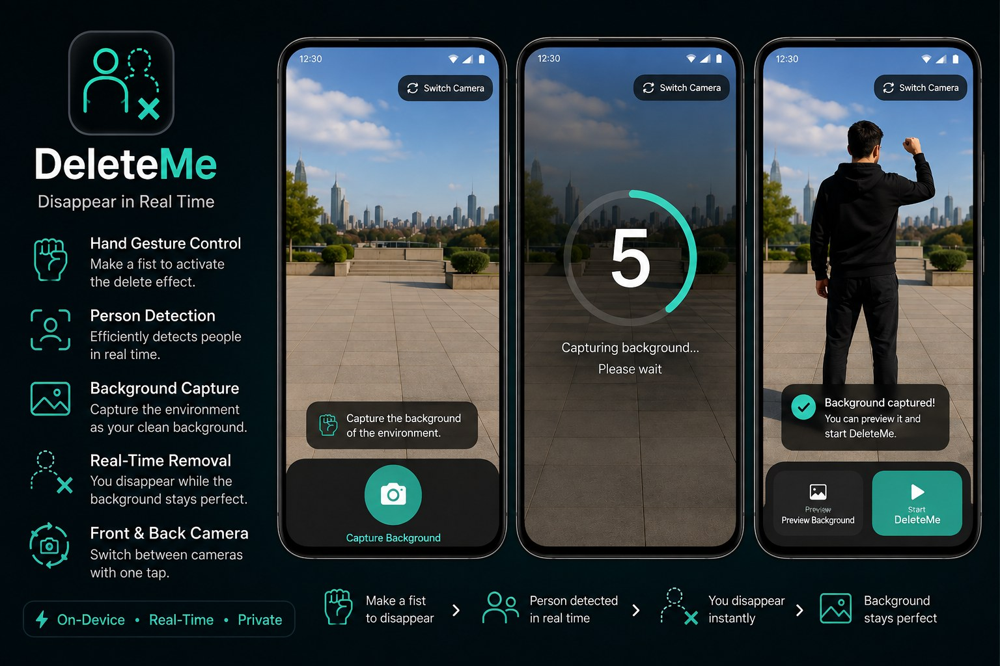

<p align="center">
  
</p>

<h1 align="center">DeleteMe</h1>

<p align="center">
  
  
  
  
</p>

<p align="center"><b>Real-time person removal from a camera feed, triggered by a hand gesture, running entirely on-device.</b></p>

DeleteMe is an Android computer-vision app that makes a person disappear from a live camera feed. It captures a clean background, watches for a closed fist using **MediaPipe Hand Landmarker**, detects the person using **MediaPipe Object Detector + EfficientDet-Lite0**, and paints the captured background over the detected person — all locally on the device, in real time.

## Table of Contents

- [Features](#features)
- [How It Works](#how-it-works)
- [Gesture Detection](#gesture-detection)
- [Person Detection](#person-detection)
- [Background Capture](#background-capture)
- [Performance](#performance)
- [Project Structure](#project-structure)
- [Main Components](#main-components)
- [Technology Stack](#technology-stack)
- [Requirements](#requirements)
- [Installation](#installation)
- [Usage](#usage)
- [Configuration](#configuration)
- [Testing](#testing)
- [Limitations](#limitations)
- [Privacy](#privacy)
- [License](#license)
- [Acknowledgements](#acknowledgements)

## Features

- Live camera preview with front/back switching (CameraX)
- One-tap background capture with a 5-second countdown
- On-device closed-fist detection via MediaPipe Hand Landmarker, debounced to avoid flicker
- On-device person detection via MediaPipe Object Detector (EfficientDet-Lite0), with largest-person selection when several people are in frame
- Real-time background compositing over the detected person
- Frame-rate limiting (~10 FPS) and single-frame-in-flight processing to keep the pipeline responsive
- Downscaled ML inference (640 × 360) kept separate from the full-resolution preview
- Clean separation between camera, vision, and UI layers
- Runtime camera-permission handling

## How It Works

```text
Camera
  → CameraX ImageAnalysis → ImageProxy → Bitmap (rotated to sensor orientation)
  → Frame-rate limiter (~10 FPS) + single-frame-in-flight lock
  → DeleteMeProcessor
        → downscale to 640×360 for ML
        → Hand Landmarker → FistClassifier → KeepState (gesture stabilization)
        → if the fist is confirmed CLOSED:
              Object Detector (EfficientDet-Lite0) → largest person bounding box
              → map bounding box back to full resolution
              → draw the captured background over that region
  → output Bitmap
  → Jetpack Compose UI
```

## Gesture Detection

MediaPipe Hand Landmarker returns 21 hand landmarks, which `FistClassifier` turns into a state:

- `OPEN` — 3 or more of the four fingers (index, middle, ring, pinky) are extended
- `CLOSED` — fewer than 3 are extended
- `NOT_DETECTED` — no hand found

`KeepState` debounces this signal over ~0.2 seconds of processed frames so a single misclassified frame doesn't flicker the effect on and off. The removal effect is only active while the fist is confirmed `CLOSED`.

## Person Detection

`PersonDetector` runs MediaPipe's Object Detector with the `efficientdet_lite0.tflite` model, restricted to the `person` category with a 0.5 confidence threshold. When multiple people are in frame, the largest bounding box by area is selected.

## Background Capture

Before the effect starts, the app captures a clean reference frame:

```text
Live camera → tap "Capture Background" → 5-second countdown → frame is stored → "Start DeleteMe"
```

That stored frame is composited into every subsequent output frame, so it should stay reasonably close to the live scene for the effect to look convincing.

## Performance

**Frame-rate limiting** — the analyzer processes about 10 FPS instead of every incoming camera frame (`FrameRateLimiter`).

**Single-frame processing** — an `AtomicBoolean` in `CameraFrameAnalyzer` guarantees only one frame is inside the ML pipeline at a time, so slow inference can't queue up a backlog of stale frames.

**ML resolution scaling** — only the ML input is downscaled to 640 × 360 (`MlFrameResizer`); the frame shown on screen stays at full camera resolution.

## Project Structure

```text
DeleteMe/
│
├── app/
│   ├── src/
│   │   ├── main/
│   │   │   ├── assets/
│   │   │   │   ├── efficientdet_lite0.tflite
│   │   │   │   └── hand_landmarker.task
│   │   │   ├── java/com/example/deleteme/
│   │   │   │   ├── camera/
│   │   │   │   ├── ui/
│   │   │   │   ├── vision/
│   │   │   │   └── MainActivity.kt
│   │   │   ├── res/
│   │   │   └── AndroidManifest.xml
│   │   └── test/java/com/example/deleteme/vision/
│   │       ├── FistClassifierTest.kt
│   │       └── KeepStateTest.kt
│   ├── build.gradle.kts
│   └── proguard-rules.pro
│
├── docs/
│   └── banner.jpg
│
├── gradle/
├── build.gradle.kts
├── gradle.properties
├── gradlew / gradlew.bat
├── settings.gradle.kts
├── .gitattributes
├── LICENSE
└── README.md
```

## Main Components

| File | Responsibility |
|---|---|
| `MainActivity.kt` | App entry point; owns and checks camera-permission state |
| `DeleteMeScreen.kt` | Top-level screen composable |
| `BackgroundCaptureScreen.kt` | Background capture flow and camera binding |
| `CameraFrameAnalyzer.kt` | Rate-limited camera frame processing |
| `FrameRateLimiter.kt` | Frame-rate control |
| `BitmapUtils.kt` | `ImageProxy` → `Bitmap` conversion |
| `DeleteMeProcessor.kt` | Main vision pipeline |
| `HandLandmarkerHelper.kt` | Hand landmark detection |
| `FistClassifier.kt` | Gesture classification |
| `HandDetectionResult.kt` | Hand detection result model |
| `HandLandmarkPoint.kt` | Landmark point model |
| `HandState.kt` | Hand state enum |
| `KeepState.kt` | Gesture debounce / stabilization |
| `MlFrameResizer.kt` | ML input resizing and coordinate mapping |
| `PersonDetector.kt` | Person detection |
| `PersonBoundingBox.kt` | Person bounding box model |

## Technology Stack

| Technology | Role |
|---|---|
| Kotlin | Application language |
| Jetpack Compose | UI framework |
| Material 3 | UI components |
| CameraX | Camera and image analysis |
| MediaPipe Tasks Vision | Computer vision APIs |
| Hand Landmarker | Hand landmark detection |
| Object Detector | Person detection |
| EfficientDet-Lite0 | Object detection model |
| Android Bitmap | Image processing |
| Gradle Kotlin DSL | Build configuration |

## Requirements

- Android Studio (recent version) with the Android SDK
- A physical Android device with a camera — the vision pipeline needs real camera and sensor input to test meaningfully
- Camera permission granted at runtime
- Android 9.0 (API 28) or newer

## Installation

```bash
git clone https://github.com/alimt-5/DeleteMe.git
cd DeleteMe
./gradlew assembleDebug        # gradlew.bat assembleDebug on Windows
```

Then open the project in Android Studio, let Gradle sync finish, and run it on a physical device.

> **Note:** `settings.gradle.kts` and `gradle-wrapper.properties` currently point at `maven.myket.ir` instead of the standard Google/Gradle mirrors, for easier access from Iran. If you're building outside that context and hit connectivity issues, swap those URLs for `dl.google.com` / `services.gradle.org`.

## Usage

1. **Grant camera permission** when prompted.
2. **Choose a camera** — front or back — with "Switch Camera".
3. **Capture the background** — point the camera at the empty scene and tap "Capture Background".
4. **Wait for the countdown** — a 5-second timer, then the frame is stored.
5. **Start DeleteMe** — tap "Start DeleteMe" once you see "Background captured".
6. **Make a fist** in view of the camera.
7. **Move** — the detected person region is replaced with the captured background for as long as the fist stays closed.

## Configuration

| Setting | Value |
|---|---|
| `compileSdk` | 35 |
| `minSdk` | 28 |
| `targetSdk` | 34 |
| ML input resolution | 640 × 360 |
| Frame processing rate | ~10 FPS |
| Gesture debounce | 0.2 s |

## Testing

```bash
./gradlew test
```

Unit coverage currently focuses on the pure-logic classes: `FistClassifier` (finger-extension thresholds) and `KeepState` (gesture debounce behavior). Camera and ML integration are not yet covered by automated tests and are best verified on a physical device.

## Limitations

- **Person detection quality** — the removal effect is only as good as the Object Detector's bounding box for that frame.
- **Fast movement** — quick motion can make the bounding box lag behind the person between processed frames.
- **Lighting** — poor or extreme lighting reduces hand and person detection accuracy.
- **Background drift** — the captured background should stay close to the live scene; anything that changes after capture (moving shadows, someone walking through) will show through.
- **Occlusion** — objects covering the person reduce detection quality.
- **Aspect ratio** — `MlFrameResizer` resizes to a fixed 640 × 360 without preserving aspect ratio; if the camera's analysis resolution isn't 16:9, the ML input is slightly stretched before inference.
- **Device performance** — real-time inference speed depends on the device's CPU/GPU.

## Privacy

The vision pipeline runs entirely on-device — camera frames are not uploaded anywhere for inference. MediaPipe Tasks support on-device execution for the tasks used here, but you should still review your own privacy, consent, and telemetry obligations before shipping an app that processes camera data of other people.

## License

This project's own source code is released under the [MIT License](LICENSE).

The two bundled model files are third-party assets and keep their original license:

- `hand_landmarker.task` — MediaPipe Hand Landmarker, Google, Apache License 2.0
- `efficientdet_lite0.tflite` — EfficientDet-Lite0 via MediaPipe Object Detector, Google, Apache License 2.0

Double-check current terms on the [MediaPipe models page](https://ai.google.dev/edge/mediapipe/solutions/vision) before redistributing them elsewhere.

## Acknowledgements

Built on:

- Android / Jetpack Compose
- CameraX
- MediaPipe Tasks Vision
- EfficientDet (Google)

MediaPipe is maintained by Google and the open-source community.

---

**Repository:** https://github.com/alimt-5/DeleteMe
